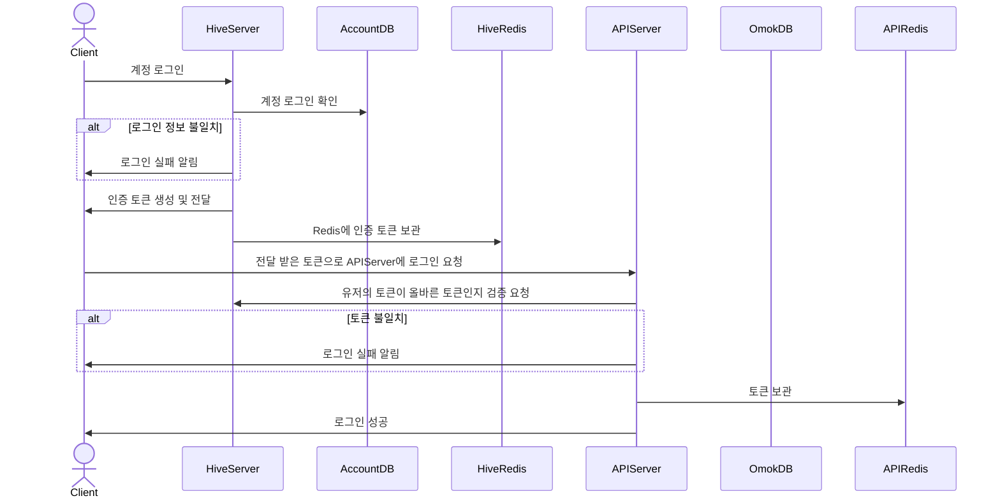

# 유저의 로그인 관련

```mermaid
sequenceDiagram
    actor Client
    participant HiveServer
    participant AccountDB
    participant HiveRedis
    participant APIServer
    participant OmokDB
    participant APIRedis
    Client ->> HiveServer: 계정 로그인
    HiveServer ->> AccountDB: 계정 로그인 확인
    alt 로그인 정보 불일치
        HiveServer ->> Client: 로그인 실패 알림
    end

    HiveServer ->> Client: 인증 토큰 생성 및 전달
    HiveServer ->> HiveRedis: Redis에 인증 토큰 보관
    Client ->> APIServer: 전달 받은 토큰으로 APIServer에 로그인 요청
    APIServer ->> HiveServer: 유저의 토큰이 올바른 토큰인지 검증 요청
    alt 토큰 불일치
        APIServer ->> Client: 로그인 실패 알림
    end

    APIServer ->> APIRedis: 토큰 보관
    APIServer ->> Client: 로그인 성공
```
