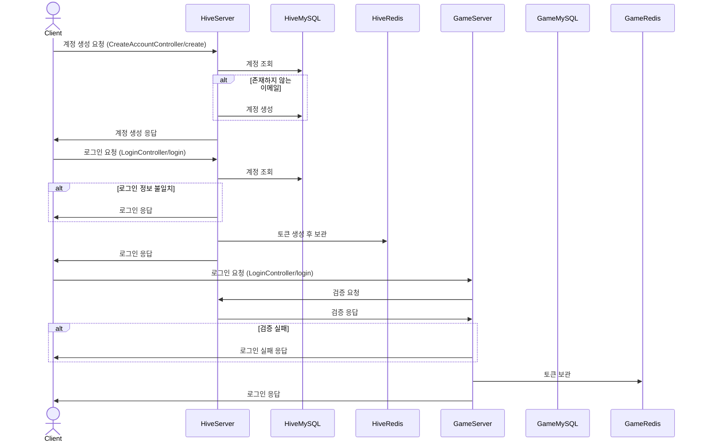
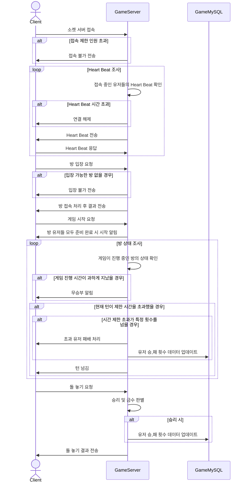

# 유저의 로그인 관련

```mermaid
sequenceDiagram
    actor Client
    participant HiveServer
    participant HiveMySQL
    participant HiveRedis
    participant GameServer
    participant GameMySQL
    participant GameRedis

    Client ->> HiveServer: 계정 생성 요청 (CreateAccountController/create)
    HiveServer ->> HiveMySQL: 계정 조회
    alt 존재하지 않는 이메일
        HiveServer ->> HiveMySQL: 계정 생성
    end

    HiveServer ->> Client: 계정 생성 응답
    Client ->> HiveServer: 로그인 요청 (LoginController/login)
    HiveServer ->> HiveMySQL: 계정 조회
    alt 로그인 정보 불일치
        HiveServer ->> Client: 로그인 응답
    end

    HiveServer ->> HiveRedis: 토큰 생성 후 보관
    HiveServer ->> Client: 로그인 응답
    Client ->> GameServer: 로그인 요청 (LoginController/login)
    GameServer ->> HiveServer: 검증 요청
    HiveServer ->> GameServer: 검증 응답
    alt 검증 실패
        GameServer ->> Client: 로그인 실패 응답
    end

    GameServer ->> GameRedis: 토큰 보관
    GameServer ->> Client: 로그인 응답
```
# 유저의 게임 진행 관련

```mermaid
sequenceDiagram
    actor Client
    participant GameServer
    participant GameMySQL

    Client ->> GameServer: 소켓 서버 접속
    alt 접속 제한 인원 초과
        GameServer ->> Client: 접속 불가 전송
    end

    loop Heart Beat 조사
        GameServer ->> GameServer: 접속 중인 유저들의 Heart Beat 확인
        alt Heart Beat 시간 초과
            GameServer ->> Client: 연결 해제
        end
        GameServer ->> Client: Heart Beat 전송
        Client ->> GameServer: Heart Beat 응답
    end

    Client ->> GameServer: 방 입장 요청
    alt 입장 가능한 방 없을 경우
        GameServer ->> Client: 입장 불가 전송
    end

    GameServer ->> Client: 방 접속 처리 후 결과 전송
    Client ->> GameServer: 게임 시작 요청
    GameServer ->> Client: 방 유저들 모두 준비 완료 시 시작 알림
    loop 방 상태 조사
        GameServer ->> GameServer: 게임이 진행 중인 방의 상태 확인
        alt 게임 진행 시간이 과하게 지났을 경우
            GameServer ->> Client: 무승부 알림
        end

        alt 현재 턴이 제한 시간을 초과했을 경우
            alt 시간 제한 초과가 특정 횟수를 넘을 경우
                GameServer ->> Client: 초과 유저 패배 처리
                GameServer ->> GameMySQL: 유저 승,패 횟수 데이터 업데이트
            end

            GameServer ->> Client: 턴 넘김
        end
    end

    Client ->> GameServer: 돌 놓기 요청
    GameServer ->> GameServer: 승리 및 금수 판별
    alt 승리 시
        GameServer ->> GameMySQL: 유저 승,패 횟수 데이터 업데이트
    end

    GameServer ->> Client: 돌 놓기 결과 전송
```
