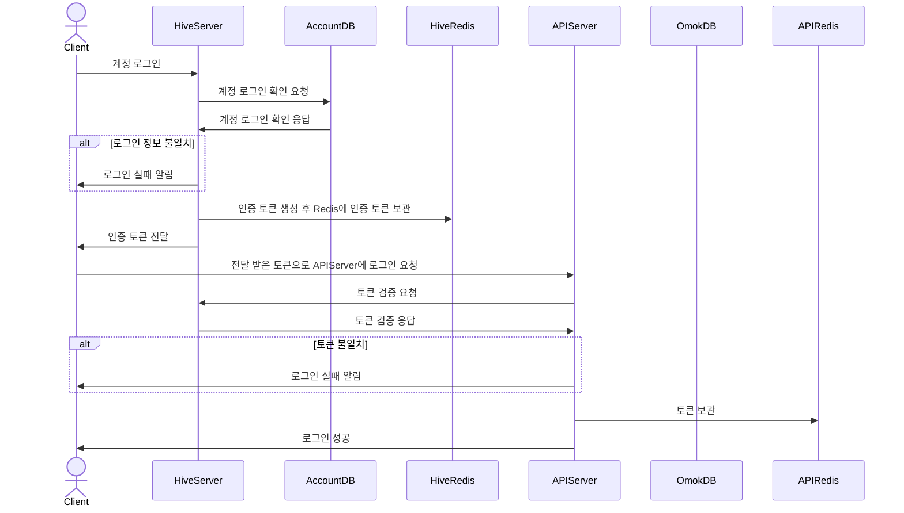

# 유저의 로그인 관련

```mermaid
sequenceDiagram
    actor Client
    participant HiveServer
    participant AccountDB
    participant HiveRedis
    participant APIServer
    participant OmokDB
    participant APIRedis
    Client ->> HiveServer: 계정 로그인
    HiveServer ->> AccountDB: 계정 로그인 확인 요청
    AccountDB ->> HiveServer: 계정 로그인 확인 응답
    alt 로그인 정보 불일치
        HiveServer ->> Client: 로그인 실패 알림
    end

    HiveServer ->> HiveRedis: 인증 토큰 생성 후 Redis에 인증 토큰 보관
    HiveServer ->> Client: 인증 토큰 전달
    Client ->> APIServer: 전달 받은 토큰으로 APIServer에 로그인 요청
    APIServer ->> HiveServer: 토큰 검증 요청
    HiveServer ->> APIServer: 토큰 검증 응답
    alt 토큰 불일치
        APIServer ->> Client: 로그인 실패 알림
    end

    APIServer ->> APIRedis: 토큰 보관
    APIServer ->> Client: 로그인 성공
```
